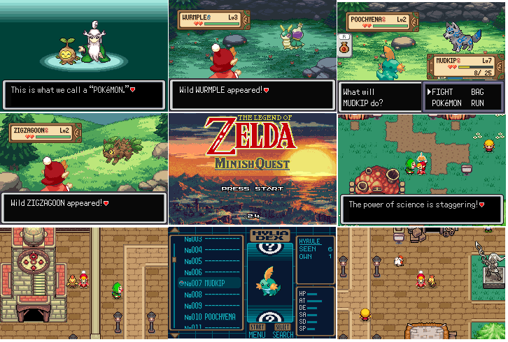

# The Legend of Zelda: Minish Quest

  

## About the Project
As a passionate fan of both *Pokémon* and *The Legend of Zelda* series, I always dreamed of creating a Pokémon ROM Hack that combines the battle/RPG system of Gen 3 Pokémon with the stunning pixel art of *The Minish Cap*. After noticing that no one had attempted this specific combination before, I decided to take on the challenge myself.

This repository hosts the assets, graphics, and source code for my upcoming ROM Hack: **The Legend of Zelda: Minish Quest.**

## The Lore
Decades ago, an incredible, tiny race known as the Minish flourished in this world. But mysteriously, they have vanished. In this era, you, your rival, and your Professor are the only known Minish left in existence. 

What happened to your people? It is up to you to uncover the truth, collect all 8 Shrine Badges and the seven Frontier Triforce symbols, and become the new Hyrule Champion.

However, you are not alone. The **Yiga Clan** and the **Sooga Clan** have begun wreaking havoc across Hyrule. The Yiga Clan seeks to revive **Calamity Groudon** to expand the land, while the Sooga Clan intends to revive **Null Kyogre** to expand the seas. Both seek to establish a new world order according to their own twisted will.

## Key Features
* **A Visual Overhaul:** Complete graphical replacement heavily inspired by *The Legend of Zelda: The Minish Cap* (Overworld, UI, tilesets, a Title Screen inspired by the Zelda 1 sunset artbook, etc.).
* **Modern Engine:** Built on the *Pokémon Modern Emerald 3.3* base by resetes12, featuring QoL improvements, Randomizers, Nuzlocke modes, Pokémon showing as surfing sprites, followers that glow at night, and more.
* **Hyrulean Forms:** Regional variants unique to this ROMHack!
    * *Example:* Torchic appears as a regional Cucco.
    * *Example:* Mudkip appears as a regional Zora.
* **Mashup Locations:** Explore a world where regions collide in a whimsical *Legend of Zelda* inspired setting! Rustboro City becomes "Rust Clock Town," Petalburg City becomes "Petalburg Ranch," and much more.

## Project Status & Usage
**Current Status:** Work in Progress (WIP).
* Currently, the exterior tilesets and gameplay are finished from the start of the game up to Rustboro City (approx. 10% of the final game).

I do not have a set ETA for the full release, and it will likely take a few years to complete. However, **I am releasing my assets as Open-Source in this repository as I finish them.** You can view the source code and build the current version here, in case you're curious to see what it looks like in-game:
[https://github.com/lbsbezerra/pokeemerald-pokezelda](https://github.com/lbsbezerra/pokeemerald-pokezelda)

## Credits
This project wouldn't be possible without the work of these talented artists:

* **El Espriteador**
* **Bilsu Art**
* **llshadow**
* **vol** (for the start menu)
* **mudskip** (for the ui_main_menu)

### ⚠️ Usage Notice
If you use any assets from this repository for your own ROM Hack, **you MUST credit the following creators:**
> **El Espriteador, Bilsu Art, llshadow, vol, mudskip, and me (leob0505)**

If I have missed anyone's name in the credits, please reach out to me and I will add them immediately!

Thank you so much, and happy ROM Hacking everyone!